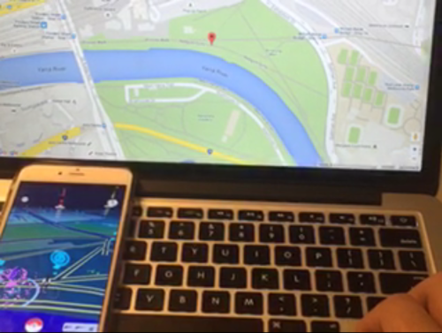

# Pokemon Go Keyboard

Play Pokemon Go with your keyboard in a browser



Environment
------------
- Python 2 or 3
- Xcode 7

Usage
------------
```bash
1. Create new Xcode project with Single View Application (or any one you like)
2. Run the app on the phone that runs Pokemon Go
3. Xcode menu -> Debug -> Simulate Location -> add GPX File to Project,
   add location.gpx to it and click location option.
4. cd path-to-clone
5. [sudo] pip install -r requirements.txt
6. ./pokemap.py
7. Drag the marker or use your arrow keys to control your location
```

TODO
----
- Display nearby pokemons, pokestops and gyms

Credits
-------
[Pokemon-Go-Controller](https://github.com/kahopoon/Pokemon-Go-Controller)
[PokemonGo-Map](https://github.com/AHAAAAAAA/PokemonGo-Map)
